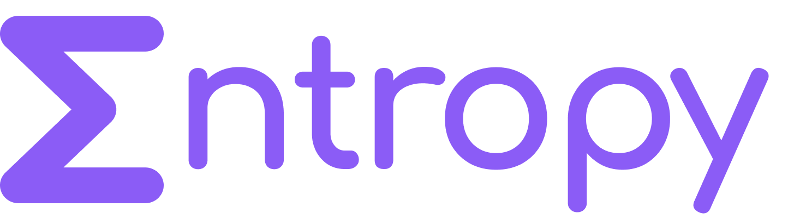

<div align="center">
  <br>
  
  <br>
  <br>
  <br>
  <p align="center">
    Modern and declarative backend development framework for Deno.
  </p>
  <h4>
    <a href="https://entropy.deno.dev" target="_blank">Website</a>
    <span> · </span>
    <a href="https://entropy.deno.dev/docs" target="_blank">Docs</a>
    <span> · </span>
    <a href="https://github.com/entropy-deno/core" target="_blank">Repository</a>
    <span> · </span>
    <a href="https://entropy.deno.dev/docs/more/contributing" target="_blank">Contributing</a>
  </h4>
  <br>
  <a href="https://deno.land/x/entropy" target="_blank">
    
    &nbsp;
    
  </a>
  <br>
</div>

## Table of contents

- [Table of contents](#table-of-contents)
- [Introducing Entropy](#introducing-entropy)
- [Requirements](#requirements)
- [Security](#security)
- [Information](#information)
- [License](#license)

## Introducing Entropy

Entropy is a modern and declarative backend development framework for Deno. It
makes it easy to create fast and secure web applications with awesome developer
experience.

> Entropy is currently in the `beta` stage. Although it is already suitable for
> creating apps, you may still encounter some bugs and breaking changes.

## Requirements

To run Entropy, your environment has to meet following requirements:

- Deno 1.36.0+

We recommend to always have the latest version of Deno installed. To update
Deno, run the following command:

```shell
deno upgrade

# on Linux and macOS you may have to run:
sudo deno upgrade
```

## Security

If you discovered any bug please open new issue / pull request in the
[repository](https://github.com/entropy-deno/core) or email me:
dom.rajkowski@gmail.com. In case of security vulnerability, please contact
[me](https://github.com/dominiq007) privately.

## Information

- Documentation: [entropy.deno.dev](https://entropy.deno.dev/docs)
- GitHub repository:
  [github.com/entropy-deno/core](https://github.com/entropy-deno/core)
- Author: [Dominik Rajkowski](https://github.com/dominiq007)

## License

Entropy is an open-source framework licensed under the
[MIT License](https://github.com/entropy-deno/core/blob/main/LICENSE).
